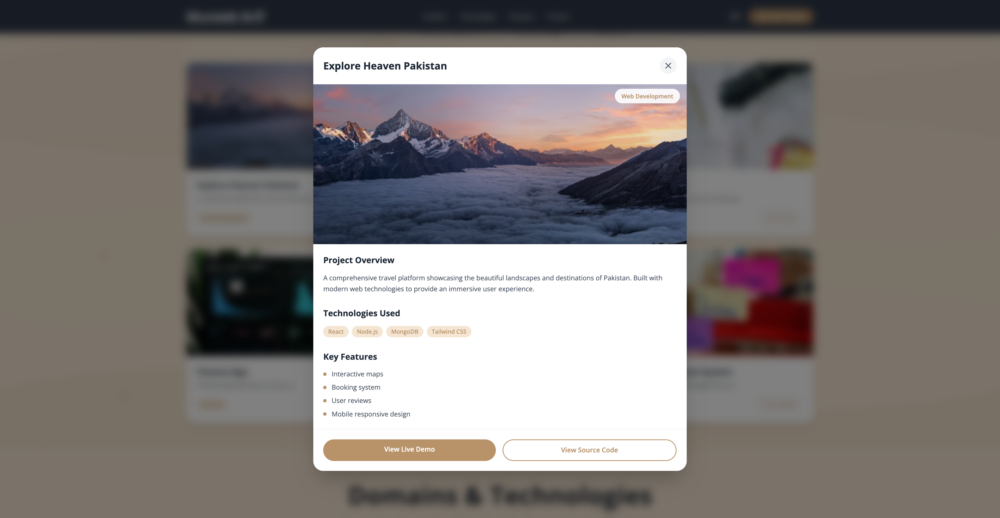
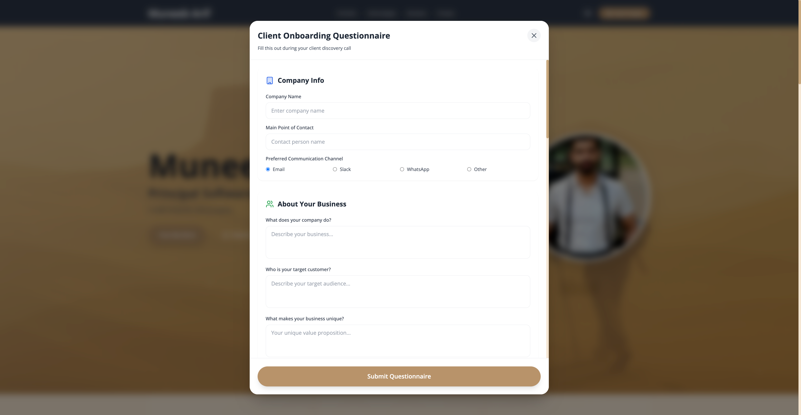

# Muneeb Arif - Principal Software Engineer Portfolio

A comprehensive, modern portfolio website built with React.js and Tailwind CSS, featuring a desert-themed design with professional animations and interactive components.


## 🌟 Live Features Overview

### 🎯 **Complete Portfolio Experience**
- **Sticky Navigation Header** with smooth scrolling and mobile-responsive design
- **Desert-Themed Hero Section** with animated water ripples and floating sand particles
- **Interactive Portfolio Grid** with category filtering and iOS-style modals
- **Technologies & Skills Showcase** with uniform card design
- **Domain Expertise Section** with detailed modal popups
- **Project Delivery Timeline** with horizontal drag-scrollable interface
- **Professional Footer** with social links and contact options
- **Contact Form & Client Onboarding** with popup modals and email integration

## 🚀 Key Features

### 📱 **Navigation & UX**
- **Sticky Header**: Fixed navigation with scroll-based styling changes
- **Smooth Scrolling**: Seamless navigation between sections
- **Mobile-First Design**: Responsive hamburger menu with slide animations
- **Keyboard Accessibility**: Full keyboard navigation and escape key support

### 🎨 **Visual Design**
- **Desert Theme**: Custom color palette (Desert Sand #E9CBA7, Wet Sand #C9A77D, Sand Dark #B8936A)
- **Floating Animations**: 40 animated sand particles with optimized performance
- **Water Ripple Effects**: Advanced CSS animations around profile image
- **Glassmorphism**: Modern backdrop blur effects in modals
- **Hover Interactions**: Scale, translate, and color transition effects

### 💼 **Portfolio Section**
- **Category Filtering**: Filter projects by Web Development, UI/UX Design, Backend
- **iOS-Style Modals**: Full-screen project details with sticky headers/footers
- **Project Showcase**: 6 sample projects with comprehensive details
- **Technology Tags**: Visual representation of tech stacks used
- **Live Demo Links**: Direct links to project demos and source code
- **Navigation Arrows**: Seamless browsing between projects with keyboard and click support


*Interactive portfolio project modal with navigation arrows and detailed project information*

### 🛠️ **Technologies Section**
- **8 Technology Cards**: Programming, Frameworks, Databases, ORM, ARM, Version Control, Cloud, Other
- **Uniform Styling**: Consistent gray overlay design across all cards
- **Visual Icons**: Lucide React icons for each technology category
- **Background Images**: Relevant tech-themed imagery

### 🎯 **Domains & Niche Section**
- **8 Domain Cards**: E-commerce, Fintech, Education, Corporate Websites, AI Chatbots, Content Generation, Visual Creation, Lesson Planning
- **Interactive Modals**: Detailed capability descriptions for each domain
- **AI Badges**: Special indicators for AI-powered services
- **Technology Tags**: Relevant tools and technologies per domain
- **Navigation Support**: Arrow keys and swipe gestures for easy browsing


*Domain expertise modal showcasing detailed capabilities and technologies*

### ⏱️ **Project Delivery Life Cycle**
- **8-Phase Timeline**: From Requirements Gathering to Post-Launch Support
- **Horizontal Scrolling**: Mouse drag functionality for timeline navigation
- **Detailed Breakdown**: Tasks and subtasks for each delivery phase
- **Visual Progress**: Color-coded timeline with gradient progression
- **Intersection Observer**: Smooth reveal animations as cards come into view
- **Navigation Arrows**: Clear visual indicators for scrollable content

### 📧 **Contact & Forms**
- **Contact Form**: Quick inquiry form with project details and comprehensive validation
- **Client Onboarding**: Comprehensive 8-section discovery questionnaire with required field validation
- **Email Integration**: Auto-generates professional emails with form data
- **Form Validation**: Real-time validation with visual error feedback and SweetAlert2 notifications
- **Responsive Design**: Mobile-optimized form layouts with touch-friendly interactions
- **Success Notifications**: Beautiful SweetAlert2 popups replace basic browser alerts

#### Contact Form - Quick Inquiries

*Professional contact form with validation for initial project discussions and discovery calls*

#### Client Onboarding - Comprehensive Project Intake

*Detailed client onboarding form with comprehensive validation for complete project requirements gathering*

## 🛠️ Tech Stack

### **Frontend**
- **React.js 18** - Modern hooks and functional components
- **Tailwind CSS** - Utility-first styling with custom configurations
- **Lucide React** - Beautiful, customizable icons
- **SweetAlert2** - Professional popup notifications and alerts
- **Modern JavaScript (ES6+)** - Async/await, destructuring, modules

### **Form Management & Validation**
- **Real-time Validation** - Field-level validation with immediate feedback
- **Error State Management** - Visual error indicators with red borders and backgrounds
- **Form Submission Handling** - Comprehensive validation before submission
- **Email Integration** - Auto-populated mailto links with structured data

### **User Experience**
- **SweetAlert2 Notifications** - Beautiful success and error popups
- **Progressive Error Disclosure** - Errors shown only after user interaction
- **Accessibility** - WCAG compliant with proper ARIA labels and screen reader support
- **Touch-Friendly Design** - Mobile-optimized form interactions

### **Animations & Effects**
- **CSS Keyframes** - Custom animations for ripples and particles
- **Intersection Observer API** - Performance-optimized scroll animations
- **RequestAnimationFrame** - Smooth 60fps particle animations
- **Transform Transitions** - Hardware-accelerated hover effects

### **Performance**
- **Component Optimization** - Memoization and efficient re-renders
- **Lazy Loading** - Optimized image loading
- **Code Splitting** - Modular component architecture
- **Memory Management** - Proper cleanup of event listeners and form state

## 📦 Installation & Development

### **Quick Start**
```bash
# Clone the repository
git clone https://github.com/muneeb-arif/portfolio-1.git
cd portfolio-1

# Install dependencies (includes SweetAlert2)
npm install

# Start development server
npm start

# Build for production
npm run build
```

### **Dependencies**
```json
{
  "react": "^18.0.0",
  "tailwindcss": "^3.0.0",
  "lucide-react": "^0.263.1",
  "sweetalert2": "^11.0.0"
}
```

### **Development Server**
The app runs on `http://localhost:3000` with hot reloading enabled.

## 🏗️ Project Architecture

```
src/
├── components/
│   ├── Header.js              # Sticky navigation with mobile menu
│   ├── Hero.js                # Desert-themed hero with animations
│   ├── FilterMenu.js          # Portfolio category filters
│   ├── PortfolioGrid.js       # Project grid layout
│   ├── Card.js                # Individual portfolio cards
│   ├── Modal.js               # iOS-style project modals
│   ├── Technologies.js        # Technology showcase section
│   ├── TechnologyCard.js      # Individual tech cards
│   ├── DomainsNiche.js        # Domain expertise section
│   ├── DomainCard.js          # Domain capability cards
│   ├── DomainModal.js         # Domain detail modals
│   ├── ProjectLifeCycle.js    # Delivery timeline section
│   ├── ContactForm.js         # Quick contact popup with validation
│   ├── ClientOnboardingForm.js # Comprehensive project form with validation
│   └── Footer.js              # Professional footer with links
├── App.js                     # Main application with particle system
├── index.js                   # React entry point
└── index.css                  # Global styles and animations
```

## 🎨 Design System

### **Color Palette**
```css
:root {
  --desert-sand: #E9CBA7;
  --wet-sand: #C9A77D;
  --sand-dark: #B8936A;
  --sand-light: #F5E6D3;
  --header-footer: rgb(55, 65, 81);
}
```

### **Typography**
- **Headings**: Bold, modern sans-serif
- **Body Text**: Clean, readable font stack
- **Interactive Elements**: Medium weight for clarity

### **Spacing & Layout**
- **Container**: Max-width with responsive padding
- **Grid System**: CSS Grid and Flexbox for layouts
- **Spacing Scale**: Consistent Tailwind spacing units

## 🔧 Customization Guide

### **Adding New Portfolio Projects**
```javascript
// In src/App.js, add to projects array:
{
  id: 7,
  title: 'Your New Project',
  description: 'Brief description',
  category: 'Web Development',
  image: 'https://your-image-url.jpg',
  buttonText: 'View Demo',
  details: {
    overview: 'Detailed project description...',
    technologies: ['React', 'Node.js', 'MongoDB'],
    features: ['Feature 1', 'Feature 2', 'Feature 3'],
    liveUrl: 'https://your-demo.com',
    githubUrl: 'https://github.com/your-repo'
  }
}
```

### **Updating Contact Information**
```javascript
// In ContactForm.js and ClientOnboardingForm.js:
const mailtoLink = `mailto:muneebarif11@gmail.com?subject=${encodeURIComponent(emailSubject)}&body=${encodeURIComponent(emailBody)}`;

// In Footer.js social links:
href="https://github.com/muneeb-arif"
href="https://www.linkedin.com/in/muneebarif11/"
href="https://instagram.com/thexpertways"
```

### **Customizing Form Validation**
```javascript
// In ContactForm.js or ClientOnboardingForm.js:
const validateField = (field, value) => {
  let error = '';
  
  switch (field) {
    case 'email':
      if (!/^[^\s@]+@[^\s@]+\.[^\s@]+$/.test(value)) {
        error = 'Please enter a valid email address';
      }
      break;
    // Add custom validation rules
  }
  
  return error;
};
```

### **Customizing SweetAlert2 Notifications**
```javascript
// Success notification example:
Swal.fire({
  title: 'Success! 🎉',
  text: 'Your custom message here',
  icon: 'success',
  confirmButtonColor: '#B8936A', // Sand-dark theme color
  customClass: {
    popup: 'rounded-3xl',
    confirmButton: 'rounded-full px-6 py-3 font-semibold'
  }
});
```

### **Modifying Animation Settings**
```css
/* In src/index.css, adjust animation timing: */
.animate-fade-in {
  animation: fadeIn 0.3s ease-out forwards;
}

/* Particle animation performance: */
const targetFPS = 12; // Adjust for performance
const particleCount = 40; // Modify particle density
```

## 📱 Responsive Design

### **Breakpoints**
- **Mobile**: 320px - 767px (Single column, stacked navigation)
- **Tablet**: 768px - 1023px (Two-column grids, optimized spacing)
- **Desktop**: 1024px+ (Full multi-column layouts, hover effects)

### **Mobile Optimizations**
- Touch-friendly button sizes (minimum 44px)
- Swipe-friendly carousels and modals
- Optimized text sizes and line heights
- Reduced animation complexity for performance

## 🔍 SEO & Performance

### **SEO Features**
- Semantic HTML5 structure
- Proper heading hierarchy (h1, h2, h3)
- Meta descriptions and titles
- Alt tags for all images
- Structured data markup ready

### **Performance Optimizations**
- **Lazy Loading**: Images load as needed
- **Code Splitting**: Components load on demand
- **Optimized Assets**: Compressed images and minified CSS
- **Efficient Animations**: Hardware-accelerated transforms
- **Memory Management**: Proper cleanup of event listeners

## 🌐 Browser Support

- **Modern Browsers**: Chrome 90+, Firefox 88+, Safari 14+, Edge 90+
- **Mobile**: iOS Safari 14+, Chrome Mobile 90+
- **Features**: CSS Grid, Flexbox, Custom Properties, Intersection Observer

## 📞 Contact & Support

**Muneeb Arif** - Principal Software Engineer

- 📧 **Email**: muneebarif11@gmail.com
- 💼 **LinkedIn**: [linkedin.com/in/muneebarif11](https://www.linkedin.com/in/muneebarif11/)
- 🐙 **GitHub**: [github.com/muneeb-arif](https://github.com/muneeb-arif)
- 📸 **Instagram**: [instagram.com/thexpertways](https://instagram.com/thexpertways)

## 📄 License

This project is open source and available under the [MIT License](LICENSE).

## 🤝 Contributing

Contributions are welcome! Please feel free to submit a Pull Request.

1. Fork the repository
2. Create your feature branch (`git checkout -b feature/AmazingFeature`)
3. Commit your changes (`git commit -m 'Add some AmazingFeature'`)
4. Push to the branch (`git push origin feature/AmazingFeature`)
5. Open a Pull Request

---

**Built with ❤️ using React.js, Tailwind CSS, and modern web technologies**

*Crafting dreams, not just projects.*

## ✅ **Form Validation Features**

### **ContactForm Validation Rules**
- **Name**: Required, minimum 2 characters
- **Email**: Required, valid email format
- **Subject**: Required, minimum 5 characters
- **Message**: Required, minimum 20 characters
- **Phone**: Optional, validates international format if provided

### **ClientOnboardingForm Validation Rules**
- **Company Name**: Required, minimum 2 characters
- **Contact Person**: Required, minimum 2 characters
- **Business Description**: Required, minimum 20 characters
- **Target Customer**: Required, minimum 15 characters
- **Problem Solving**: Required, minimum 20 characters
- **Core Features**: Required, minimum 15 characters
- **Budget Range**: Required for project planning

### **Validation UX Features**
- **Real-time Feedback**: Validation on blur, error clearing on input
- **Visual Indicators**: Red borders and backgrounds for invalid fields
- **Error Messages**: Clear, actionable error descriptions with icons
- **Form Submission**: Comprehensive validation before email generation
- **SweetAlert2 Integration**: Professional error and success notifications 